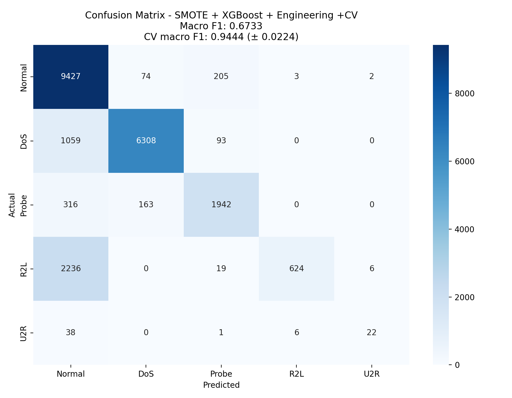

Course: Advanced Python (ICS0019)

Team members: Kaspars Kusiņš, Maksym Korchan

Date: 22.05.2026

Repository link: https://github.com/maxkorch-27/llm-training

1\. Approach

1.1 Strategy Overview

Our strategy was to improve detection of minority attack classes, especially R2L and U2R, because the initial Random Forest model identified them as normal traffic. We concentrated on imbalance handling techniques -- class_weight=\'balanced\', SMOTE oversampling, and later added XGBoost. Experiments were conducted with feature selection and feature engineering to examine whether extra preprocessing could improve minority class detection and Macro F1 score.

1.2 Preprocessing

Describe any changes you made to the data beyond the starter code:

Feature engineering: We added 3 more features:

- bytes\_*ratio: src_bytes / dst_bytes to measure relationship between the amount of data sent by the source host and the amount of data returned by the destination host.*

- *total_bytes: src*\_bytes + dst_bytes to measure total volume of traffic exchanged.

- error_rate: serror_rate + rerror_rate to measure total intensity of connection errors.

Feature selection: We tried SelectKBest with k=25 at some tests, but when applying on script with XGBoost + SMOTE, it actually reduced Macro F1.

Scaling: none

1.3 Class Imbalance Handling

How did you address the imbalance between classes?

Method used: class_weight=\'balanced\', SMOTE oversampling, SMOTE + XGBoost

Parameters:

SMOTE:

Random_state=42

RandomForest:

> Class_weight=\'balanced\'

XGBoost:

> N_estimators:300
>
> Max_depth=8
>
> Learning_rate=0.1
>
> Subsample=0.8
>
> Colsample_bytree=0.8
>
> Objective=\'multi:softprob\'
>
> Random_state=42

Effect on training set distribution:

> Before SMOTE:
>
> Normal: 67342
>
> DoS: 45927
>
> Probe: 11656
>
> R2L: 995
>
> U2R: 52
>
> After SMOTE:
>
> All classes balanced to 67343 samples each.

2\. Experiments

Total number of experiments: 7

**Experiment 1: Baseline run**

Algorithm: Random Forest with default parameters

What changed from baseline: Nothing --- this is our own baseline run

Macro F1 (CV): 0.9201 (+-0.0212)

Macro F1 (test): 0.5009

Observation: Baseline model performed adequate on normal DoS traffic but almost no detections regarding minority classes, like R2L, U2R attacks. Minority attacks were classified as Normal traffic.

**Experiment 2: class weight balanced applied**

Algorithm: Random Forest with class_weight=\'balanced\'

What changed: Added class weighting to make the model pay more attention to minority classes.

Macro F1 (CV): 0.8814 (+- 0.0187)

Macro F1 (test): 0.4753

Observation: Detection for minority classes improved slightly, but overall Macro F1 score decreased compared to baseline. This experiment is not sufficient for handling severe imbalances.

**Experiment 3: class weight balanced + SMOTE**

Algorithm: Random Forest with SMOTE oversampling and class_weight=\'balanced\'

What changed: Applied SMOTE oversampling before training while keeping class balancing enabled.

Macro F1 (CV): 0.9016 (+-0.0152)

Macro F1 (test): 0.5321

Observation: SMOTE visibly increased R2L detection and slightly improved U2R detection. Macro F1 score increased compared to past experiments due to balanced training data access.

**Experiment 4: SelectKBest applied**

Algorithm: SelectKBest (k=25) was applied.

What changed: Instead of taking 40 features, only 25 best are taken for model training.

Macro F1 (CV): 0.8702 (+-0.0104)

Macro F1 (test): 0.5130

Observation: Macro F1 improved slightly compared to baseline (+0.0121) and CV reduced by almost 5%. Feature selection reduced some noisy information. As CV reduced, highly predictive training-specific features were removed too, making it a better generalization as gap between scores reduced.

**Experiment 5: XGBoost + SMOTE**

Algorithm: XGBoost with SMOTE oversampling

What changed: Replaced Random Forest with XGBoost whilst keeping SMOTE balanced

Macro F1 (CV): 0.9473 (+-0.0190)

Macro F1 (test): 0.6242

Observation: Outputted the strongest performance so far; R2L and U2R detection improved substantially, while Probe and DoS also improved. XGBoost handled traffic patterns

**Experiment 6: XGBoost + SMOTE + SelectKBest**

Algorithm: XGBoost + SMOTE script with SelectKBest (k=25) on top.

What changed: Compared to previous script (sequential training and SMOTE for imbalance handling) only top 25 features were used for training. XGBoost surpassed Random Forest in terms of complex traffic patterns.

Macro F1 (CV): 0.8797 (+- 0.0193)

Macro F1 (test): 0.5733

Observation: Both macro F1 and CV macro F1 reduced compared to just XGBoost + SMOTE script, meaning that important features were removed and XGBoost lost useful patterns.

**Experiment 7: XGBoost + SMOTE + Feature Engineering**

Algorithm: XGBoost + SMOTE with 3 features added during preprocessing.

What changed: 3 new features: bytes\_*ratio, total*\_*bytes and error*\_rate.

Macro F1 (CV): 0.9444 (+-0.0224)

Macro F1 (test): 0.6733

Observation: Adding of those 3 features helped model to learn on asymmetric traffic, traffic intensity and connection errors patterns. It increased macro F1 by approximately 4% meaning that increasing number of learning patterns is actually good for XGBoost.

Experiments Summary

| N | Description | Algorithm | Imbalance Handling | Macro F1 (CV) | Macro F1 (test) |
|----|----|----|----|----|----|
| 1 | Baseline run | RandomForest | none | 0.9201 | 0.5009 |
| 2 | Balanced weight | RandomForest | Class weighting | 0.8814 | 0.4753 |
| 3 | Balanced weight + SMOTE | RandomForest | SMOTE + class weighting | 0.9016 | 0.5321 |
| 4 | Feature selection | SelectKBest, k=25 | none | 0.8702 (+-0.0104) | 0.5130 |
| 5 | XGBoost + SMOTE | XGBoost | SMOTE | 0.9473 | 0.6242 |
| 6 | Ex. 5 + f. selection | Ex.5 and SelectKBest, k=25 | SMOTE | 0.8797 (+- 0.0193) | 0.5733 |
| 7 | Ex. 5 + f. engineering | Ex.5 and 3 new features descr. above | SMOTE | 0.9444 (+-0.0224) | 0.6733 |

3\. Final Results

3.1 Best Model

Algorithm: XGBoost

Key parameters: n_estimators=300, max_depth=8, learning_rate=0.1, subsample=0.8, colsample_bytree=0.8, objective=\'multi:softprob\', num_class=5, eval_metric=\'mlogloss\', random_state=42, n_jobs=-1.

Imbalance handling: SMOTE

Feature engineering: added src_bytes/dst_bytes ratio, total bytes src_bytes+dst_bytes and error_rate = serror_rate+rerror_rate

3.2 Final Macro F1-Score

| Metric          | Score             |
|-----------------|-------------------|
| Macro F1 (test) | 0.6733            |
| Macro F1 (CV)   | 0.9444 (+-0.0224) |

3.3 Classification Report

| Category | Precision | Recall | F1-Score | Support |
|----------|-----------|--------|----------|---------|
| Normal   | 0.72      | 0.97   | 0.83     | 9711    |
| DoS      | 0.96      | 0.85   | 0.90     | 7460    |
| Probe    | 0.86      | 0.80   | 0.83     | 2421    |
| R2L      | 0.99      | 0.22   | 0.35     | 2885    |
| U2R      | 0.73      | 0.33   | 0.45     | 67      |

3.4 Confusion Matrix

\

4\. Cross-Validation vs. Test Score

CV macro F1: 0.9444 (+-0.0224)

Test macro F1: 0.6733

Gap: 0.2711

Analysis: The gap between cross-validation and test performance is expected because KDDTest+ contains attack types and traffic patterns not present in the training data. It also suggests some degree of overfitting, as the model learned the training distribution very well after SMOTE balancing but generalized less effectively to unseen attacks.

5\. What Worked and What Didn\'t

What had the biggest positive impact?

- Adding of XGBoost, meaning not randomized but a sequential training of a model significantly improved macro F1

What surprisingly didn\'t help?

- SelectKBest was not that helpful. Only +1% macro F1 at baseline and even reduced result at XGBoost + SMOTE.

What would you try with more time?

- Deeper feature engineering. As it made F1 better with 3 features, i would probably do even better with more features.

Appendix: Environment

Maksym K.:

Hardware: ASUS Zenbook 14, AMD Ryzen AI 7 350 w, 32 GB RAM.

Python version: 3.13

Key libraries: xgboost==3.2.0, scikit-learn==1.8.0, imbalanced-learn==0.14.1, sklearn-compat==0.1.5

Random seed: 42

Kaspars K.:

Hardware: Apple Macbook Air M4, 24 GB RAM.

Python version: 3.13

Key libraries: XGBoost,

Random seed: 42
